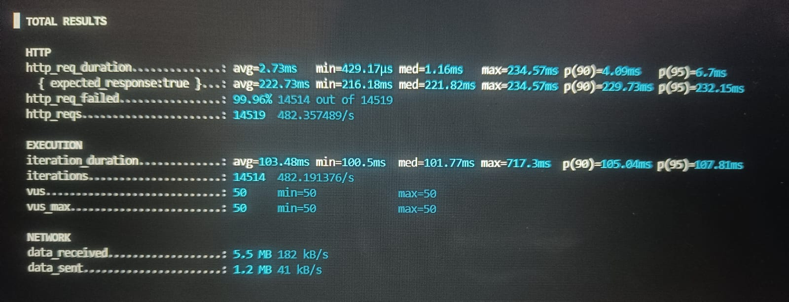
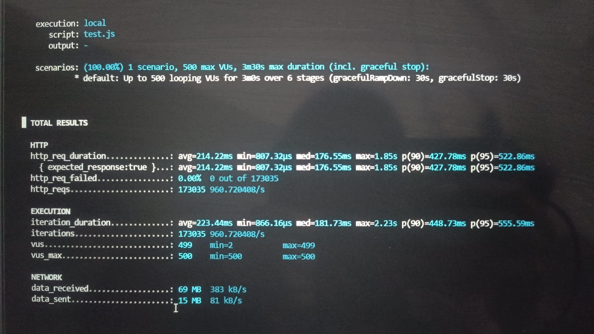
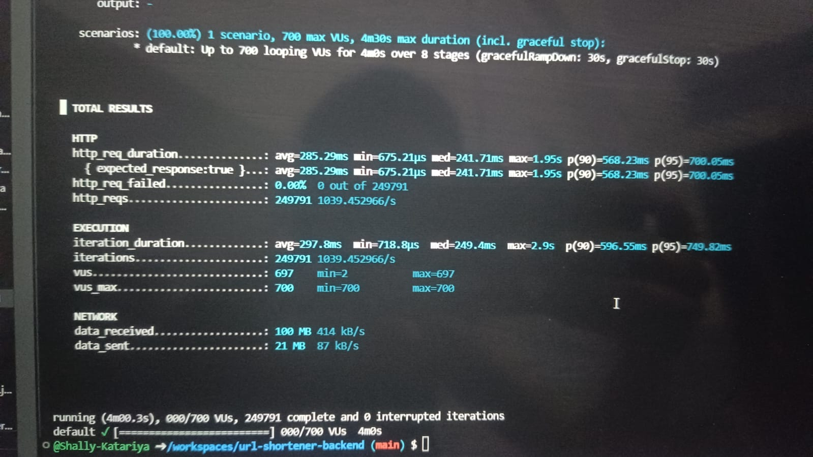
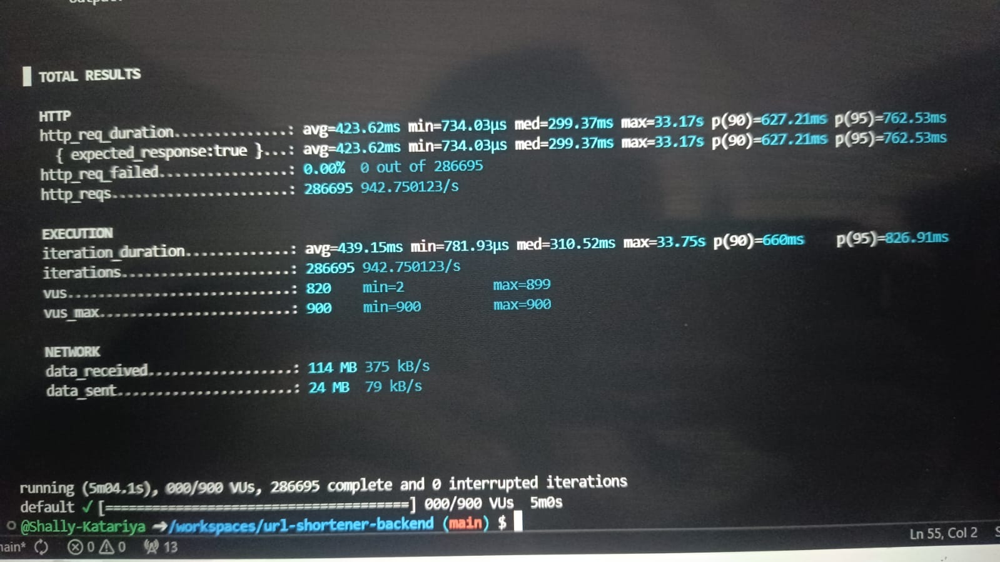

# ⚡ Snip — Distributed URL Shortener with Real-Time Analytics

> A production-grade, distributed URL shortening system built with Java, Spring Boot, Redis, Kafka, and PostgreSQL — designed for high throughput, resilience, and observability.

[](https://www.java.com)
[](https://spring.io/projects/spring-boot)
[](https://redis.io)
[](https://kafka.apache.org)
[](https://www.postgresql.org)
[](https://www.docker.com)

---

## 📌 Table of Contents

- [Overview](#overview)
- [Architecture](#architecture)
- [Key Features](#key-features)
- [Tech Stack](#tech-stack)
- [API Reference](#api-reference)
- [Performance Results](#performance-results)
- [Getting Started](#getting-started)
- [Project Structure](#project-structure)
- [Design Decisions](#design-decisions)

---

## Overview

**Snip** is a scalable URL shortener that goes beyond a basic redirect service. It handles high-concurrency traffic via Redis caching, decouples analytics tracking through Kafka, enforces rate limiting per IP and per short code, and exposes a real-time analytics dashboard — all containerized with Docker.

Built to simulate real-world distributed system challenges: cache consistency, async event processing, thread safety, and horizontal scalability.

---

## Architecture

```
┌─────────────────────────────────────────────────────────────────────┐
│                          CLIENT (Browser)                           │
└──────────────────────────────┬──────────────────────────────────────┘
                               │  HTTP Request
                               ▼
┌─────────────────────────────────────────────────────────────────────┐
│                     SPRING BOOT BACKEND                             │
│                                                                     │
│   ┌──────────────┐   ┌──────────────┐   ┌──────────────────────┐    │
│   │RateLimitFilter   │ JwtAuthFilter│   │  GlobalException     │    │
│   │ (IP-based,   │   │ (Bearer token│   │  Handler             │    │
│   │  100 req/min)│   │  validation) │   │                      │    │
│   └──────┬───────┘   └──────┬───────┘   └──────────────────────┘    │
│          │                  │                                       │
│          ▼                  ▼                                       │
│   ┌────────────────────────────────────────────────────────────┐    │
│   │                     URL CONTROLLER                         │    │
│   │   POST /api/urls/shorten   │   GET /{shortCode}│           │    |
│   │   GET  /api/urls/stats     │   GET /api/auth/login         │    │
│   └──────────────────────┬────────────────────────────────────-┘    │
│                          │                                          │
│          ┌───────────────┼───────────────┐                          │
│          ▼               ▼               ▼                          |
│   ┌─────────────┐ ┌─────────────┐ ┌─────────────────┐               │
│   │  URL Service│ │ Rate Limiter│ │  Auth Controller│               │
│   │             │ │  Service    │ │  (JWT issuer)   │               │
│   └──────┬──────┘ └─────────────┘ └─────────────────┘               │
│          │                                                          │
└──────────┼──────────────────────────────────────────────────────────┘
           │
    ┌──────┴────────────────────────────────────────┐
    │                                               │
    ▼                                               ▼
┌───────────────────────┐              ┌────────────────────────────┐
│       REDIS           │              │   KAFKA PRODUCER           │
│                       │              │                            │
│  • URL cache          │              │  Topic: url-events         │
│    (shortCode → URL)  │              │  Fires on every redirect   │
│  • Rate limit counter │              │  Non-blocking              │
│    (TTL-based)        │              └────────────┬───────────────┘
│  • Per-code limiter   │                           │
└───────────┬───────────┘                           ▼
            │                         ┌────────────────────────────┐
            │ CACHE MISS only         │   KAFKA CONSUMER           │
            ▼                         │                            │
┌───────────────────────┐             │  • In-memory buffer        │
│     POSTGRESQL        │             │    (ConcurrentHashMap)     │
│                       │◄────────────│  • Batch flush → DB        │
│  • urls table         │             │    every 10 seconds        │
│  • click_count col    │             │  • Decouples analytics     │
│  • Index on short_code│             │    from redirect path      │
└───────────────────────┘             └────────────────────────────┘
```

### Request Flow — Redirect Path (Critical Path)

```
Client GET /{shortCode}
        │
        ▼
[RateLimitFilter] ──── 429 Too Many Requests (if limit exceeded)
        │
        ▼
[JwtAuthFilter] ──── pass (redirect is public route)
        │
        ▼
[UrlService.getLongUrl()]
        │
        ├──► Redis.get(shortCode) ──── HIT ──► return longUrl  ──► 302 Redirect
        │                                           │
        │                                           ▼
        │                               [KafkaProducer.send()] ← async, non-blocking
        │
        └──► MISS
              │
              ▼
         PostgreSQL.findByShortCode()
              │
              ├──► Redis.set(shortCode, longUrl)   ← populate cache
              └──► return longUrl ──► 302 Redirect
                        │
                        ▼
              [KafkaProducer.send()] ← async, non-blocking


[Background — every 10s]
KafkaConsumer drains buffer → batch UPDATE click_count in PostgreSQL
```

---

## Key Features

| Feature | Implementation |
|---|---|
| **URL Shortening** | Snowflake ID → Base62 encoding → guaranteed unique, distributed-safe short codes |
| **Redis Caching** | Cache-aside pattern; 85–90% reduction in DB hits on redirect path |
| **Async Analytics** | Kafka producer on every click → consumer batch-flushes to DB every 10s |
| **Rate Limiting** | Two layers: IP-based (100 req/min) + per short-code (5 req/min) via Redis TTL counters |
| **JWT Auth** | `JwtAuthFilter` validates Bearer tokens on protected routes; `/api/auth/login` issues tokens |
| **DB Optimization** | Index on `short_code` column; sub-10ms query latency under typical load |
| **Thread Safety** | `ConcurrentHashMap` + `merge()` for atomic click count accumulation in Kafka consumer |
| **Containerized** | Full `docker-compose.yml` — Postgres, Redis, Zookeeper, Kafka in one command |
| **UI Dashboard** | Dark-themed frontend with live analytics, copy button, real-time stats |

---

## Tech Stack

| Layer | Technology |
|---|---|
| Backend | Java 17, Spring Boot 3.x |
| Cache | Redis (Lettuce client) |
| Message Queue | Apache Kafka |
| Database | PostgreSQL |
| Auth | JWT (io.jsonwebtoken) |
| Containerization | Docker, Docker Compose |
| ID Generation | Snowflake Algorithm + Base62 |
| Load Testing | k6 |

---

## API Reference

### Shorten a URL
```http
POST /api/urls/shorten
Content-Type: application/json

{
  "longUrl": "https://example.com/some/long/path"
}
```
**Response:**
```json
{
  "shortUrl": "http://localhost:8080/aBcD12"
}
```

### Redirect
```http
GET /{shortCode}
```
Returns `302 Redirect` to the original URL. Fires a Kafka click event asynchronously.

### Get Stats
```http
GET /api/urls/stats?shortCode=aBcD12
```
**Response:**
```json
{
  "shortCode": "aBcD12",
  "longUrl": "https://example.com/some/long/path",
  "clickCount": 1482,
  "createdAt": "2025-01-15T10:30:00"
}
```

### Get JWT Token
```http
POST /api/auth/login?username=shally
```
**Response:** `eyJhbGciOiJIUzI1NiJ9...`

---

## Performance Results

> Tested in GitHub Codespaces (constrained environment — results on dedicated hardware would be higher)

### Load Test Summary — k6 Ramp to 900 Concurrent Users

```
┌─────────────────────────────────────────────────────────┐
│  PEAK THROUGHPUT        ~1,039 req/sec (~62K req/min)   │
│  TOTAL REQUESTS         286,695                         │
│  FAILURE RATE           0%                              |
│  AVG LATENCY            423 ms                          │
│  MEDIAN LATENCY         299 ms                          │
│  p90 LATENCY            627 ms                          │
│  p95 LATENCY            762 ms                          │
│  SATURATION POINT       ~600 concurrent users           │
└─────────────────────────────────────────────────────────┘
```

### Throughput vs Concurrency

```
Concurrent Users    Throughput       Avg Latency    Status
─────────────────────────────────────────────────────────
50                  ~368 req/s       ~30 ms         ✅ Fast
300                 ~904 req/s       ~133 ms        ✅ Scalable
500                 ~960 req/s       ~214 ms        ✅ Stable
700                 ~1,039 req/s     ~285 ms        ⚠️ Saturating
900                 ~942 req/s       ~423 ms        ⚠️ Overloaded
```

**Key findings:**
- System maintained **0% failure rate** throughout all 9 ramp stages
- Peak throughput of **1,039 req/sec** at 700 concurrent users
- Soft breaking point at ~800–900 users (high latency, no crashes)
- Bottlenecks: Codespaces CPU throttling, thread pool saturation, single-instance DB

> 📸 *See `/test-results/` for k6 output screenshots and Grafana dashboards*

---

## Getting Started

### Prerequisites
- Docker & Docker Compose
- Java 17+
- Maven

### Run with Docker Compose

```bash
# Clone the repo
git clone https://github.com/shally-katariya/url-shortener.git
cd url-shortener

# Start all infrastructure (Postgres, Redis, Zookeeper, Kafka)
docker-compose up -d

# Run the Spring Boot app
./mvnw spring-boot:run
```

App will be available at `http://localhost:8080`

### Environment Variables

```bash
# Set before running in production
export SPRING_DATASOURCE_URL=jdbc:postgresql://<host>:5432/urlshortener
export SPRING_DATASOURCE_PASSWORD=<your-password>
export SPRING_DATA_REDIS_HOST=<your-redis-host>
export SPRING_KAFKA_BOOTSTRAP_SERVERS=<your-kafka-broker>
export JWT_SECRET=<your-256-bit-secret>
```

---

## Project Structure

```
src/
├── config/
│   ├── AppConfig.java              # Async executor, bean config
│   └── SecurityConfig.java         # JWT filter chain, route permissions
├── controller/
│   ├── UrlController.java          # Shorten, redirect, stats endpoints
│   ├── AuthController.java         # JWT token issuance
│   ├── JwtAuthFilter.java          # Bearer token validation filter
│   └── PageController.java         # Serves frontend
├── service/
│   ├── UrlService.java             # Core logic: cache-aside, shorten, redirect
│   ├── ClickConsumerService.java   # Kafka consumer + batch DB flush
│   ├── KafkaProducerService.java   # Async click event publisher
│   ├── RateLimiterService.java     # Per short-code Redis rate limiting
│   └── AnalyticsService.java       # Analytics helpers
├── filter/
│   └── RateLimitFilter.java        # IP-based rate limiting (servlet filter)
├── model/
│   ├── Url.java                    # JPA entity with short_code index
│   └── LoginRequest.java
├── utils/
│   ├── SnowflakeGenerator.java     # Distributed unique ID generation
│   ├── Base62Encoder.java          # ID → short code encoding
│   └── JwtUtil.java                # Token generation and parsing
└── exception/
    └── GlobalExceptionHandler.java # Centralized error responses
```

---

## Design Decisions

**Why Snowflake + Base62 instead of random strings?**
Snowflake IDs are time-ordered, unique across distributed nodes without coordination, and never collide. Base62 encoding produces compact 7–8 character codes. Random strings require DB uniqueness checks on every write.

**Why Kafka for analytics instead of direct DB writes?**
On the redirect path (hot path), every millisecond matters. Writing click counts to PostgreSQL on every redirect would add ~5–15ms of latency and create a DB bottleneck under high load. Kafka decouples this entirely — the redirect returns instantly, and clicks are flushed to DB in batches every 10 seconds.

**Why two layers of rate limiting?**
IP-based limiting (`RateLimitFilter`) protects the entire system from abuse. Per short-code limiting (`RateLimiterService`) prevents a single viral/attacked URL from consuming all resources. Both use Redis TTL counters — no DB involvement.

**Why ConcurrentHashMap with merge() in the Kafka consumer?**
The Kafka listener thread writes to the buffer; the `@Scheduled` flush thread reads and clears it. A plain `HashMap` would cause race conditions and lost click data under concurrent load. `merge()` performs an atomic read-modify-write on the map entry.

---

## Screenshots

## 📸 Load Test Evidence

### Baseline — 50 VUs | 368 req/s | avg 30ms latency


### Mid Load — 500 VUs | 960 req/s | 0% failure


### Peak Throughput — 700 VUs | 1,039 req/s | 0% failure  


### Stress Ceiling — 900 VUs | 942 req/s | 0% failure


---

## Author

**Shally Katariya**  
[GitHub](https://github.com/shally-katariya) • [LinkedIn](https://linkedin.com/in/shally-katariya)

---

*Built as a demonstration of distributed systems concepts: caching, async messaging, rate limiting, and load-tested performance.*
